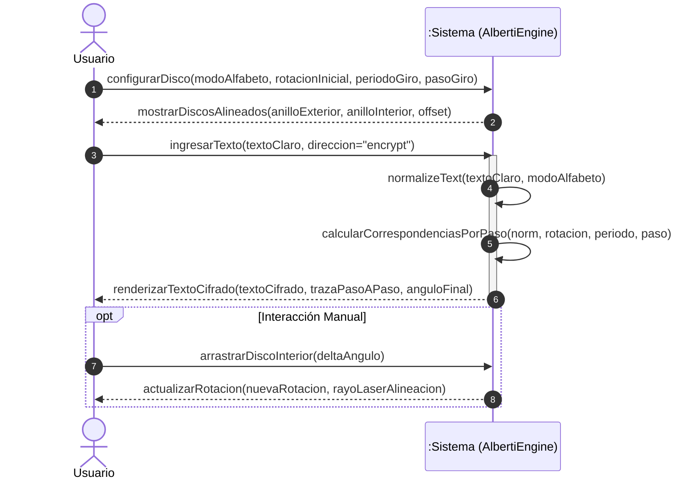
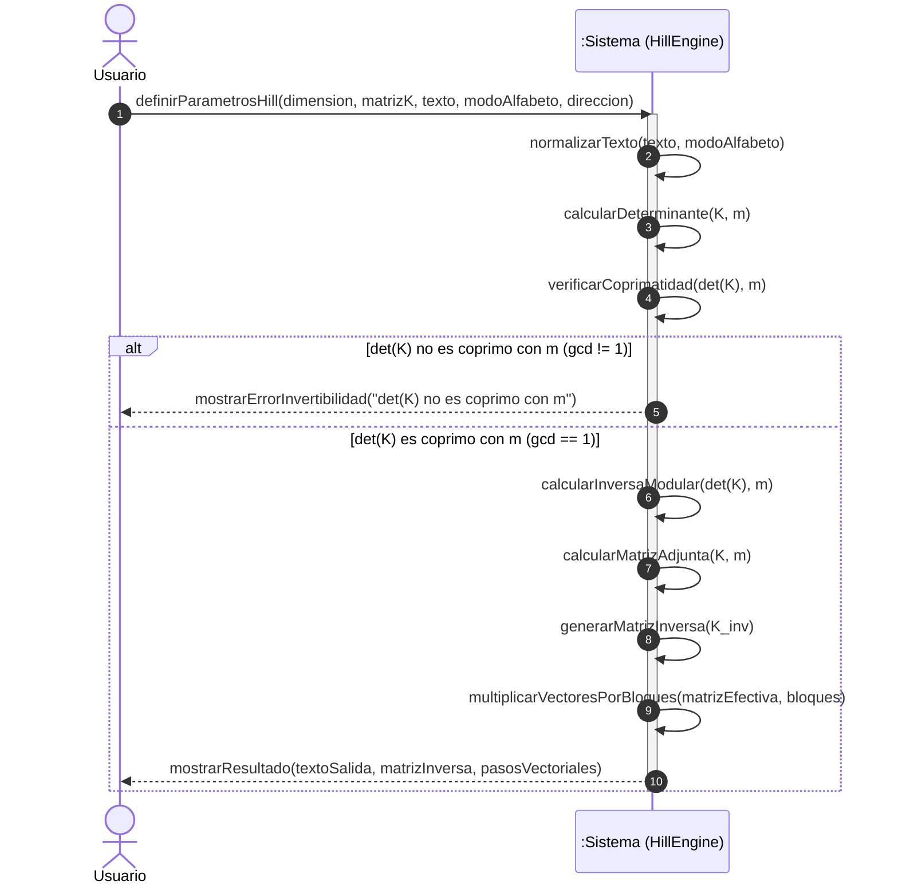
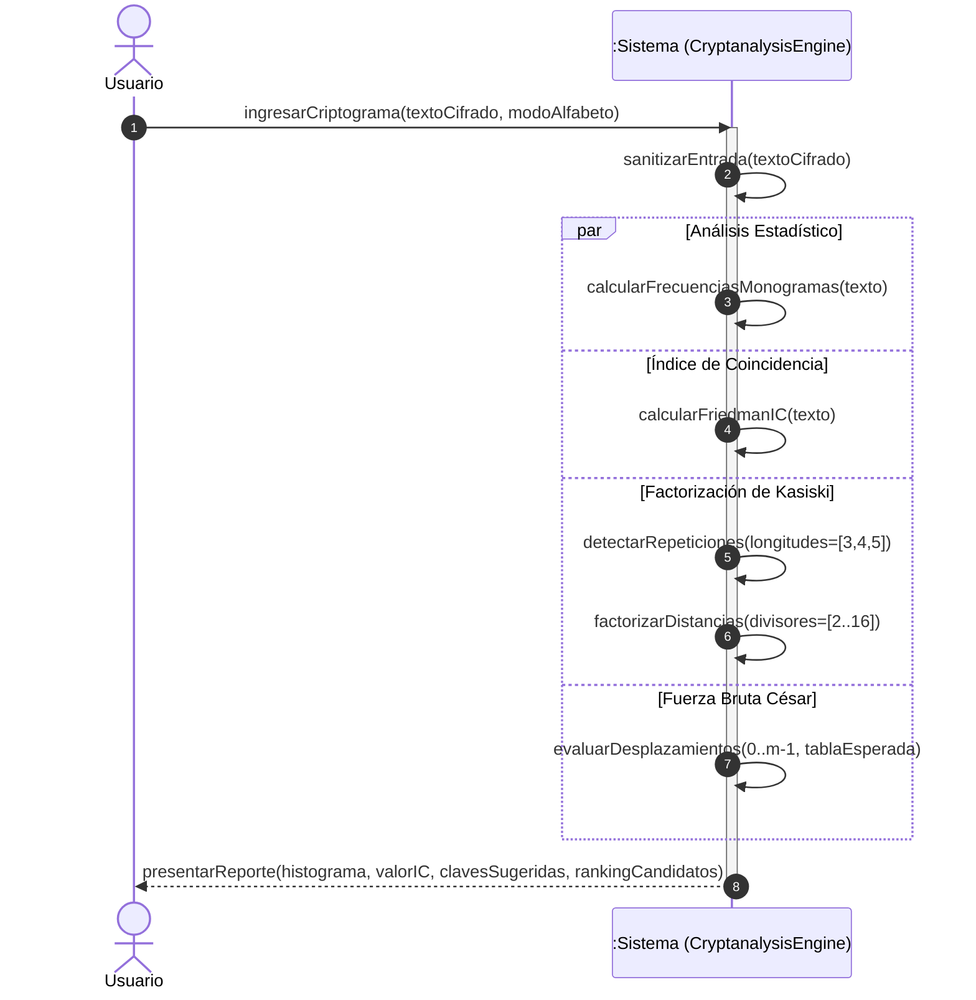
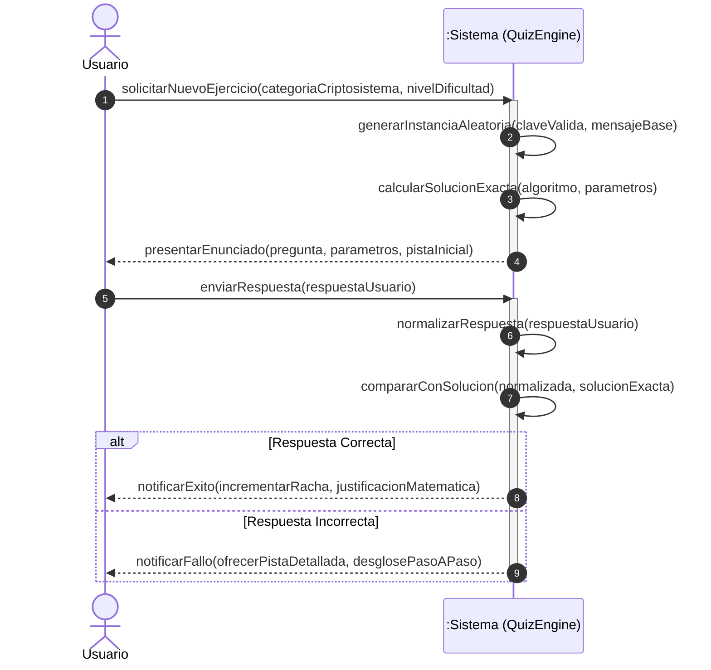

# Especificación Técnica de Arquitectura, Estructura del Software, Diagramas de Secuencia (SSD) y Seguridad (SSDLC)

Este documento describe la estructura de directorios por capas y tecnologías, los **Diagramas de Secuencia del Sistema (SSD en notación UML)** y los mecanismos del **Ciclo de Vida de Desarrollo de Software Seguro (SSDLC)** implementados en la plataforma *Criptografía Interactiva*.

---

## 1. Patrón Arquitectónico del Software

El proyecto implementa los principios de **Clean Architecture (Arquitectura Limpia)** y **Separación de Responsabilidades (Separation of Concerns)** adaptados a aplicaciones web modernas. La regla fundamental es que **la lógica criptográfica y matemática es agnóstica de la interfaz gráfica** y no posee dependencias sobre React ni sobre el DOM.

```
+-------------------------------------------------------------------------+
|                       CAPA DE PRESENTACION (UI)                         |
|  Tecnologias: React 19, Tailwind CSS v4, Recharts, Lucide, SVG          |
|  - Tabs de Navegacion (Laboratorio, Practica, Criptoanalisis, Teoria)   |
|  - Visualizadores Especializados (AlbertiDisk, HillTool, CaesarWheel)   |
|  - Graficos Estadisticos Interactivos (Recharts Histogram & Kasiski)   |
+------------------------------------+------------------------------------+
                                     | Eventos de Usuario (Props / Callbacks)
                                     v
+-------------------------------------------------------------------------+
|                  CAPA DE CONTROL Y ESTADO DE APLICACION                 |
|  Tecnologias: React Hooks (useState, useMemo, useCallback)              |
|  - Gestion de Contexto de Alfabeto (es27 / en26 / alberti24)            |
|  - Sincronizacion de Parametros y Formularios                           |
+------------------------------------+------------------------------------+
                                     | Invocacion de Funciones Puras
                                     v
+-------------------------------------------------------------------------+
|                 CAPA DE DOMINIO Y CALCULO (NUCLEO PURO)                 |
|  Tecnologias: TypeScript 5.7 estricto (Sin dependencias de UI ni DOM)   |
|  - Aritmetica Modular y Algebra Lineal (mathUtils.ts)                   |
|  - Definicion y Normalizacion de Alfabetos (alphabets.ts)               |
|  - Algoritmos de Cifrado Clasico (src/crypto/ciphers/)                  |
|  - Motor de Criptoanalisis Estadistico (cryptanalysis.ts)               |
|  - Generador Determinista de Problemas (exercises.ts)                   |
+-------------------------------------------------------------------------+
```

---

## 2. Mapa Estructural de Carpetas por Tecnologías y Responsabilidad

A continuación se detalla la estructura física del proyecto clasificada por capas funcionales y tecnologías empleadas, como estándar de referencia para desarrollo de software:

```
Cryptography-Interactive-Learning/
├── .github/                              # [CAPA CI/CD & AUTOMATIZACION]
│   └── workflows/
│       └── deploy.yml                    # Pipeline GitHub Actions (Build & Deploy a GitHub Pages)
│
├── public/                               # [CAPA DE RECURSOS ESTATICOS INMUTABLES]
│   ├── manifest.json                     # Configuracion Web App / PWA
│   └── robots.txt                        # Directivas de indexacion web
│
├── docs/                                 # [CAPA DE DOCUMENTACION TECNICA]
│   └── ARCHITECTURE_AND_SECURITY.md      # Especificacion de Arquitectura, SSD y Seguridad
│
├── tests/                                # [CAPA DE PRUEBAS AUTOMATIZADAS]
│   └── crypto-security.test.mjs          # Suite de pruebas unitarias, algebraicas y de seguridad
│
├── src/                                  # [CODIGO FUENTE DE LA APLICACION]
│   │
│   ├── crypto/                           # >>> CAPA DE DOMINIO (LOGICA PURA & TYPESCRIPT) <<<
│   │   ├── alphabets.ts                  # Alfabetos (mod 26, mod 27), mapeo de caracteres y frecuencias
│   │   ├── mathUtils.ts                  # Aritmetica modular: gcd, euclides extendido, matrices 2x2/3x3
│   │   ├── cryptanalysis.ts              # Histogramas, Indice de Friedman, Test de Kasiski, Fuerza Bruta
│   │   ├── exercises.ts                  # Motor generador de ejercicios y validacion matematica
│   │   └── ciphers/                      # Submodulo de Algoritmos Criptograficos Clasicos
│   │       ├── alberti.ts                # Motor de giros y paso a paso del Disco de Alberti
│   │       ├── caesarAffine.ts           # Algoritmos Cesar, Afin y Cesar Mixto
│   │       ├── hill.ts                   # Transformaciones lineales y producto matricial modular
│   │       ├── playfair.ts               # Cifrado digramico y matriz 5x5 Playfair
│   │       ├── polybius.ts               # Tablero de Polibio
│   │       ├── transposition.ts          # Escitala Espartana y Transposicion Columnar
│   │       └── vigenere.ts               # Cifrador de Vigenere, Beaufort y Autoclave
│   │
│   ├── components/                       # >>> CAPA DE PRESENTACION (REACT 19 + TAILWIND CSS) <<<
│   │   ├── Navbar.tsx                    # Cabecera interactiva y selector global de alfabeto
│   │   │
│   │   ├── tabs/                         # Vistas / Controladores de Pestana
│   │   │   ├── InteractiveLabTab.tsx     # Laboratorio de simulacion interactiva
│   │   │   ├── PracticeQuizTab.tsx       # Modulo de autoevaluacion y ejercicios
│   │   │   ├── CryptanalysisTab.tsx      # Laboratorio de criptoanalisis estadistico
│   │   │   └── EncyclopediaTab.tsx       # Enciclopedia historico-teorica con citas APA 7
│   │   │
│   │   └── visualizers/                  # Componentes Graficos de Simulacion (SVG & Interaccion)
│   │       ├── AlbertiDisk.tsx           # Disco concentrico SVG arrastrable con rayo laser
│   │       ├── CaesarWheel.tsx           # Rueda de calculo modular interactiva
│   │       ├── HillMatrixTool.tsx        # Calculadora matricial con determinantes e inversas
│   │       ├── PlayfairGrid.tsx          # Grilla 5x5 con trazado de digramas
│   │       ├── ScytaleColumnar.tsx       # Baston cilindrico y rejillas de transposicion
│   │       └── VigenereTabula.tsx        # Tabula Recta interactiva con coordenadas
│   │
│   ├── App.tsx                           # Componente raiz y orquestador de vistas
│   ├── main.tsx                          # Punto de entrada React (DOM Mounting)
│   ├── index.css                         # Estilos globales y configuracion Tailwind CSS v4
│   └── vite-env.d.ts                     # Definiciones de tipo para el entorno Vite
│
├── package.json                          # [CONFIGURACION DE DEPENDENCIAS Y SCRIPTS]
├── tsconfig.json                         # [CONFIGURACION DEL COMPILADOR TYPESCRIPT]
├── vite.config.ts                        # [CONFIGURACION DEL BUNDLER VITE 8]
├── .gitignore                            # [REGLAS DE EXCLUSION DE CONTROL DE VERSIONES]
├── SECURITY.md                           # [POLITICA DE SEGURIDAD Y MARCO SSDLC / STRIDE]
├── LICENSE                               # [LICENCIA DE CODIGO ABIERTO MIT]
└── README.md                             # [MANIFIESTO PRINCIPAL DEL PROYECTO]
```

---

## 3. Diagramas de Secuencia del Sistema (SSD - UML)

Los Diagramas de Secuencia del Sistema modelan los eventos de entrada y salida generados por el actor externo (Usuario) en la frontera del sistema.

### 3.1 SSD-01: Simulación y Cifrado con Disco de Alberti



### 3.2 SSD-02: Cifrado y Descifrado Matricial de Hill (2×2 y 3×3)



### 3.3 SSD-03: Criptoanálisis de Criptogramas



### 3.4 SSD-04: Estudio de Ejercicios y Autoevaluación



---

## 4. Contratos de Operaciones del Sistema

| Operación | Precondición | Postcondición | Invariante de Seguridad |
| :--- | :--- | :--- | :--- |
| `processCaesar(text, shift, mode, dir)` | `text` es una cadena de texto; `shift` $\in \mathbb{Z}$; `mode` $\in \{\text{'es27'}, \text{'en26'}\}$. | Retorna texto procesado y pasos donde $C_i = (M_i \pm k) \pmod m$. | Todo caracter de salida pertenece al conjunto del alfabeto seleccionado. |
| `processAffine(text, config, dir)` | $\gcd(a, m) = 1$ donde $m$ es el módulo del alfabeto. | Si $\gcd(a,m) = 1$, retorna $C_i = (a M_i + b) \pmod m$ o su inversa. En caso contrario, retorna error controlado. | No se ejecutan divisiones por cero ni estados de cálculo indefinido. |
| `processHill2x2/3x3(text, K, mode, dir)` | Matriz $K$ de dimensión $n \times n$ con entradas enteras. | Si $\gcd(\det(K), m) = 1$, procesa los bloques y calcula $K^{-1}$. En caso contrario, aborta la operación. | La longitud del texto de salida es siempre un múltiplo exacto de la dimensión $n$. |
| `performKasiski(text, mode)` | `text` es una cadena de caracteres. | Retorna patrones repetidos y factores comunes ordenados por frecuencia. | Entradas mayores a $10\,000$ caracteres se acotan para evitar bloqueos del hilo (*Denial of Service*). |

---

## 5. Marco de Desarrollo de Software Seguro (SSDLC)

El ciclo de vida del proyecto incorpora controles de seguridad en cada una de sus fases:

1. **Fase de Requisitos y Diseño:**
   - Adopción de arquitectura *Zero-Knowledge / 100% Client-Side*.
   - Definición de listas blancas de caracteres para evitar inyecciones.
2. **Fase de Implementación:**
   - Tipado estático estricto en TypeScript.
   - Programación defensiva con validación previa de condiciones matemáticas necesarias para biyectividad ($\gcd(a, m) = 1$, matrices regulares).
3. **Fase de Verificación y Pruebas:**
   - Suite de pruebas unitarias automatizadas (`tests/crypto-security.test.mjs`) que validan la simetría $\mathcal{D}_K(\mathcal{E}_K(M)) = M$ y la neutralización de ataques de inyección y sobrecarga.
4. **Fase de Despliegue y Mantenimiento:**
   - Pipeline de integración continua mediante GitHub Actions con compilación limpia (`tsc --noEmit` y `vite build`).

---

## 6. Taxonomía de Capas en la Ingeniería de Software: Frontend vs Backend vs APIs vs BD

En la arquitectura de software profesional, cada componente tiene un rol, alcance y responsabilidad bien delimitada:

| Capa / Componente | ¿Dónde se ejecuta? | Responsabilidad Principal | Tecnologías Típicas | Rol en esta Plataforma |
| :--- | :--- | :--- | :--- | :--- |
| **Frontend (Cliente)** | Navegador web / Dispositivo del usuario | Renderizado de interfaz gráfica (UI), experiencia de usuario (UX), gráficos interactivos y captura de eventos. | React 19, TypeScript, Tailwind CSS, Vite, Canvas, SVG. | **Activo**: Gestiona la interfaz, visualizadores interactivos (Alberti, Polibio, Hill) y el cálculo matemático *client-side*. |
| **Backend (Servidor)** | Servidores en la nube / Contenedores | Lógica de negocio central, orquestación de transacciones, autenticación centralizada, procesamiento pesado por lotes y seguridad server-side. | Node.js (NestJS / Fastify), Python (FastAPI / Django), Go, Java (Spring Boot). | *Diseñado para integración futura* en escenarios multi-usuario o evaluación institucional. |
| **APIs & Endpoints** | Capa de Transporte / Gateway | Protocolos de comunicación estandarizados para intercambio de datos estructurados entre Frontend y Backend. | REST (JSON), GraphQL, gRPC, WebSockets, OpenAPI / Swagger. | *Estandarizado en contratos TypeScript* (`src/types/`) listo para consumir endpoints remotos. |
| **Base de Datos (BD)** | Motor de Persistencia / Almacenamiento | Almacenamiento persistente, indexación, integridad referencial y consulta de datos structured/unstructured. | PostgreSQL, MySQL, Redis (Cache/Sesiones), MongoDB. | *Modelos tipados en `src/types/`* listos para mapearse a esquemas ORM (Prisma / TypeORM). |

---

## 7. Mapeo de Panoramas de Despliegue y Escalabilidad Futura

Para asegurar que la plataforma esté preparada para cualquier requerimiento futuro de producción o despliegue institucional, se definen **3 panoramas arquitectónicos escalables**:

### Panorama 1: Edge PWA / Static Single-Page App (Arquitectura Actual)
* **Objetivo**: Máxima velocidad, costo cero de infraestructura de servidor y privacidad absoluta (*Zero-Knowledge*).
* **Flujo**: El usuario descarga los archivos estáticos inmutables (`HTML/JS/CSS`) desde un CDN global (GitHub Pages, Cloudflare Pages o AWS S3/CloudFront).
* **Cómputo**: Todo el procesamiento criptográfico y matemático se ejecuta en la CPU del cliente. No requiere backend ni base de datos para operar al 100%.

```
[Usuario / Navegador] ──(HTTPS)──> [CDN / GitHub Pages (Archivos Estáticos)]
        │
        └───> Motor Criptográfico en TypeScript (Ejecución Local 100% Client-Side)
```

### Panorama 2: Plataforma Académica Multi-Usuario (Full-Stack LMS)
* **Objetivo**: Registro de estudiantes, control de asistencia, guardado de calificaciones de quizzes y telemetría de laboratorio.
* **Flujo**: El Frontend actual se conecta mediante peticiones seguras (`HTTPS + JWT / OAuth2`) a una API REST en Node.js/Python respaldada por una base de datos relacional.

```
[Frontend (React + Vite)]
        │  (HTTPS / REST API con Token JWT)
        ▼
[API Gateway / Backend Server (FastAPI / NestJS)]
        ├───> [Base de Datos PostgreSQL] (Usuarios, Notas, Historial de Prácticas)
        └───> [Redis Cache] (Sesiones activas y Rate Limiting)
```

### Panorama 3: Arquitectura Cloud Distribuida de Alta Concurrencia (Enterprise)
* **Objetivo**: Simulación masiva en tiempo real para miles de estudiantes concurrentes con análisis de fuerza bruta en clústeres de servidores.
* **Flujo**: Microservicios en contenedores Docker orquestados con Kubernetes, colas asíncronas de mensajes (RabbitMQ / Kafka) para tareas pesadas de criptoanálisis y base de datos distribuida.

```
                    ┌─── Microservicio Autenticación (OAuth2 / SAML)
                    ├─── Microservicio Evaluaciones (PostgreSQL)
[API Gateway] ──────┼─── Microservicio Criptoanálisis Distribuido (Workers GPU)
                    └─── Cola de Tareas Asíncronas (RabbitMQ / Redis)
```

