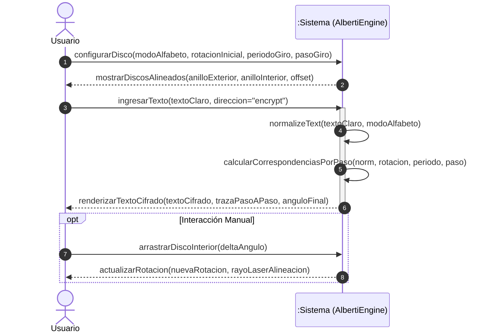
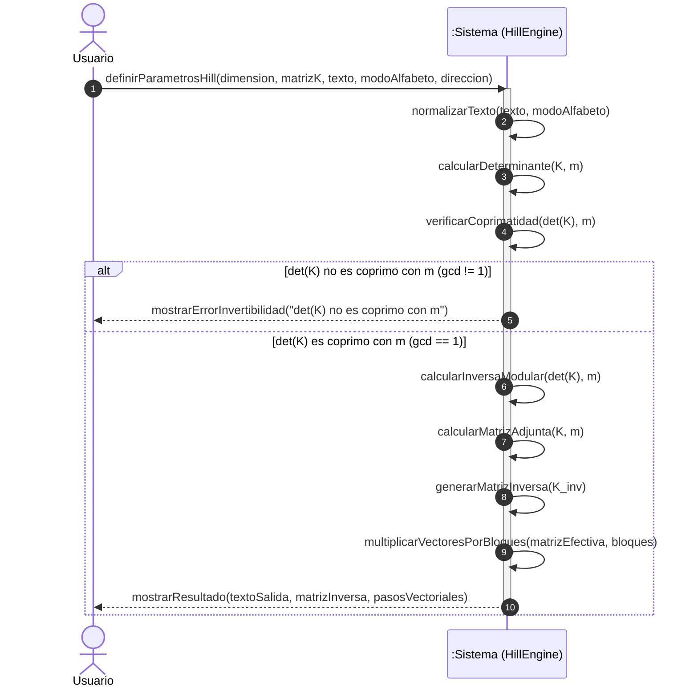
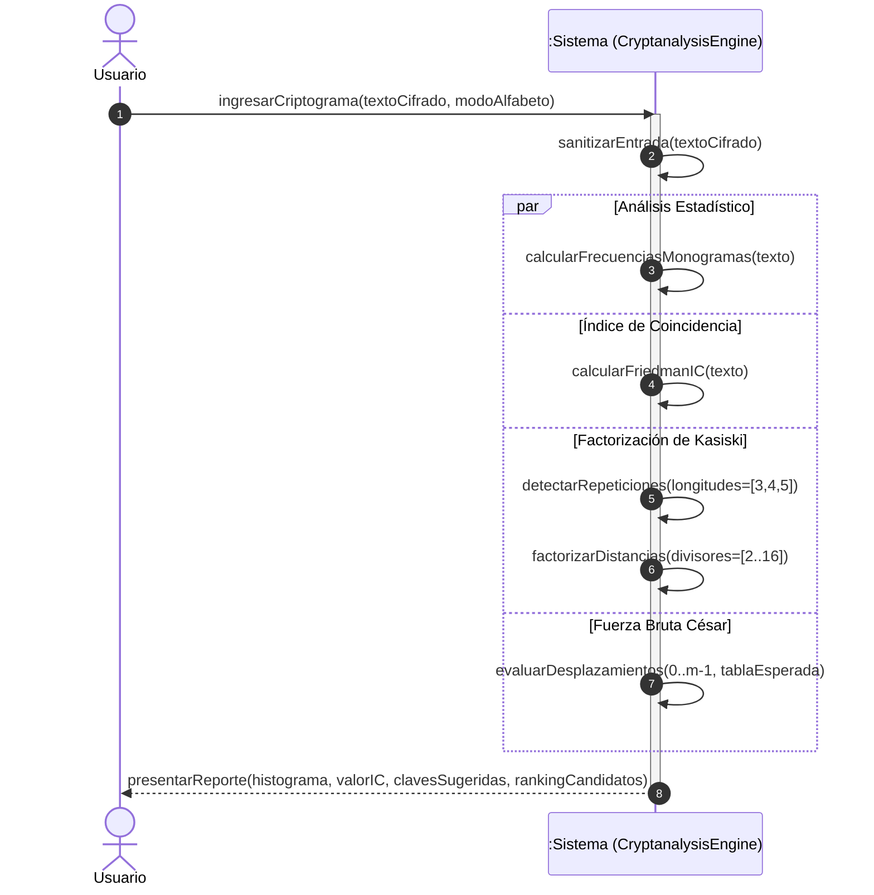
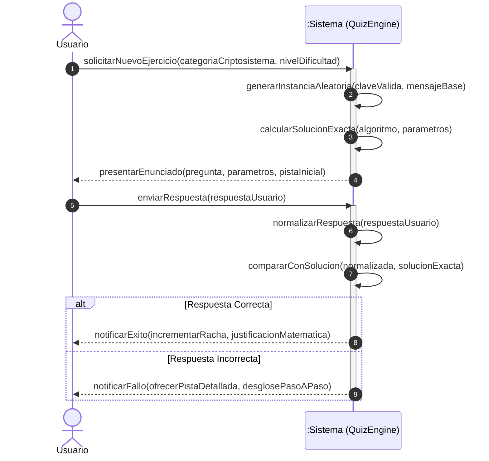

# Especificación Técnica de Arquitectura, Diagramas de Secuencia del Sistema (SSD) y Seguridad (SSDLC)

Este documento describe la arquitectura modular, los **Diagramas de Secuencia del Sistema (SSD en notación UML)** y los mecanismos del **Ciclo de Vida de Desarrollo de Software Seguro (SSDLC)** implementados en la plataforma *Criptografía Interactiva*.

---

## 1. Arquitectura del Sistema

La arquitectura de la aplicación sigue un patrón desacoplado en tres capas con flujo de datos unidireccional y funciones algebraicas puras en el núcleo de cálculo.

```
+------------------------------------------------------------------+
|                    Capa de Presentación (UI)                     |
|  - Tabs de Navegación (Laboratorio, Práctica, Criptoanálisis)     |
|  - Visualizadores Interactivos (Alberti SVG, Hill, Tabula, etc.) |
+---------------------------------+--------------------------------+
                                  | Eventos de Usuario
                                  v
+------------------------------------------------------------------+
|                 Capa de Control y Estado React                   |
|  - Gestión de Modo de Alfabeto (mod 26 / mod 27)                 |
|  - Sincronización de Parámetros de Cifrado                       |
+---------------------------------+--------------------------------+
                                  | Invocación de Operaciones
                                  v
+------------------------------------------------------------------+
|               Capa de Dominio y Cálculo (src/crypto)             |
|  - Normalización y Filtrado (alphabets.ts)                       |
|  - Aritmética Modular y Álgebra Lineal (mathUtils.ts)            |
|  - Motores de Cifrado y Criptoanálisis (ciphers/, cryptanalysis) |
+------------------------------------------------------------------+
```

---

## 2. Diagramas de Secuencia del Sistema (SSD - UML)

Los Diagramas de Secuencia del Sistema modelan los eventos de entrada y salida generados por el actor externo (Usuario) en la frontera del sistema.

### 2.1 SSD-01: Simulación y Cifrado con Disco de Alberti



### 2.2 SSD-02: Cifrado y Descifrado Matricial de Hill (2×2 y 3×3)



### 2.3 SSD-03: Criptoanálisis de Criptogramas



### 2.4 SSD-04: Estudio de Ejercicios y Autoevaluación



---

## 3. Contratos de Operaciones del Sistema

| Operación | Precondición | Postcondición | Invariante de Seguridad |
| :--- | :--- | :--- | :--- |
| `processCaesar(text, shift, mode, dir)` | `text` es una cadena de texto; `shift` $\in \mathbb{Z}$; `mode` $\in \{\text{'es27'}, \text{'en26'}\}$. | Retorna texto procesado y pasos donde $C_i = (M_i \pm k) \pmod m$. | Todo caracter de salida pertenece al conjunto del alfabeto seleccionado. |
| `processAffine(text, config, dir)` | $\gcd(a, m) = 1$ donde $m$ es el módulo del alfabeto. | Si $\gcd(a,m) = 1$, retorna $C_i = (a M_i + b) \pmod m$ o su inversa. En caso contrario, retorna error controlado. | No se ejecutan divisiones por cero ni estados de cálculo indefinido. |
| `processHill2x2/3x3(text, K, mode, dir)` | Matriz $K$ de dimensión $n \times n$ con entradas enteras. | Si $\gcd(\det(K), m) = 1$, procesa los bloques y calcula $K^{-1}$. En caso contrario, aborta la operación. | La longitud del texto de salida es siempre un múltiplo exacto de la dimensión $n$. |
| `performKasiski(text, mode)` | `text` es una cadena de caracteres. | Retorna patrones repetidos y factores comunes ordenados por frecuencia. | Entradas mayores a $10\,000$ caracteres se acotan para evitar bloqueos del hilo (*Denial of Service*). |

---

## 4. Marco de Desarrollo de Software Seguro (SSDLC)

El ciclo de vida del proyecto incorpora controles de seguridad en cada una de sus fases:

1. **Fase de Requisitos y Diseño:**
   - Adopción de arquitectura *Zero-Knowledge / 100% Client-Side*.
   - Definición de listas blancas de caracteres para evitar inyecciones.
2. **Fase de Implementación:**
   - Tipado estático estricto en TypeScript.
   - Programación defensiva con validación previa de condiciones matemáticas necesarias para biyectividad ($\gcd(a, m) = 1$, matrices regulares).
3. **Fase de Verificación y Pruebas:**
   - Suite de pruebas unitarias automatizadas (`tests/crypto-security.test.mjs`) que validan la simetría $\mathcal{D}_K(\mathcal{E}_K(M)) = M$ y la neutralización de ataques de inyección y sobrecarga.
4. **Fase de Despliegue y Mantenimiento:**
   - Pipeline de integración continua mediante GitHub Actions con compilación limpia (`tsc --noEmit` y `vite build`).
